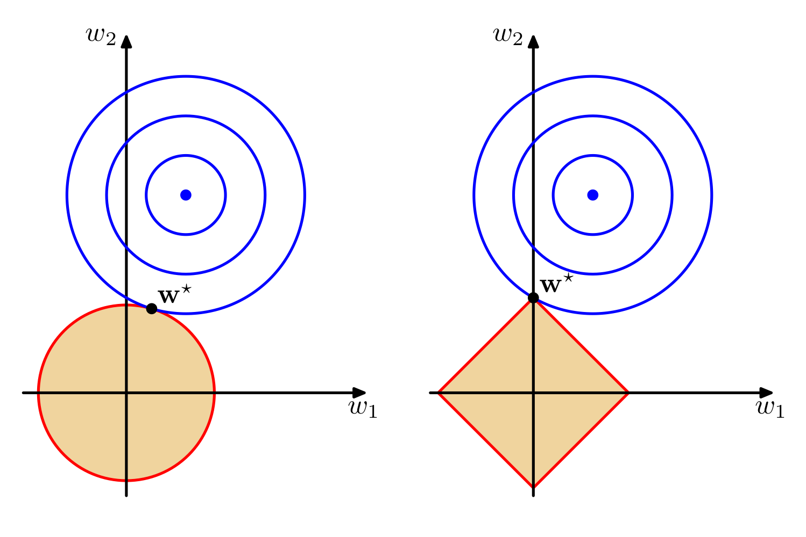
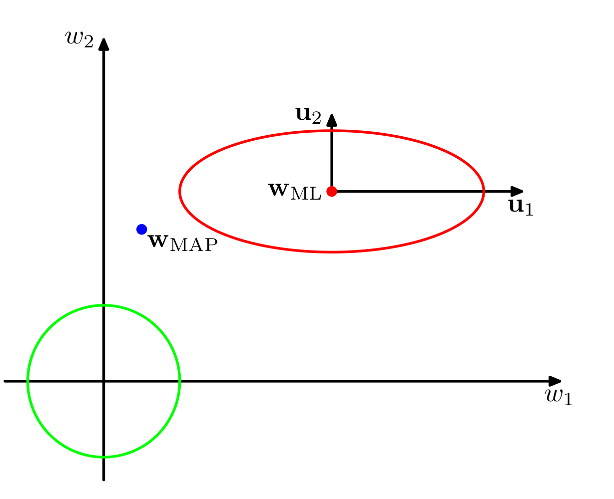

- [Ch3 Linear Models for Regression](#ch3-linear-models-for-regression)
  - [3.1. Linear basis function models](#31-linear-basis-function-models)
    - [3.1.1. Maximum likelihood and least squares](#311-maximum-likelihood-and-least-squares)
    - [3.1.2. Geometry of least sqaures](#312-geometry-of-least-sqaures)
    - [3.1.3. Sequential learning](#313-sequential-learning)
    - [3.1.4. Regularized least squares](#314-regularized-least-squares)
    - [3.1.5. Multiple outputs](#315-multiple-outputs)
  - [3.2. The bais-variance decomposition](#32-the-bais-variance-decomposition)
  - [3.3. Bayesian linear regression](#33-bayesian-linear-regression)
    - [3.3.1. Parameter distribution](#331-parameter-distribution)
    - [3.3.2. Predictive distribution](#332-predictive-distribution)
    - [3.3.3. Equivalent kernel](#333-equivalent-kernel)
  - [3.4. Bayesian model comparison](#34-bayesian-model-comparison)
  - [3.5. Evidence appximation](#35-evidence-appximation)
    - [3.5.1. Evaluation of evidence function](#351-evaluation-of-evidence-function)
    - [3.5.2. Maximizing the evidence function](#352-maximizing-the-evidence-function)
    - [3.5.3. Effective number of parameters](#353-effective-number-of-parameters)
  - [3.6. Limitations of fixed basis functions](#36-limitations-of-fixed-basis-functions)

# Ch3 Linear Models for Regression

Study a class of regression models that are linear functions of the parameters.

## 3.1. Linear basis function models

A simple form of the linear regression model gives

$$
y(\mathbf{x}, \mathbf{w}) = w_0 + w_1 x_1 + \cdots + w_{M-1} x_{M-1}
$$

where $\mathbf{x} = (x\_1, \dots, x\_{M-1})^{\mathsf {T}}$ and $\mathbf{w} = (w\_0, w\_1, \dots, w\_{M-1})^{\mathsf {T}}$.

It is a linear model of both parameters and input variables. We want to extend it by introducing nonlinear functions of input variables, which gives

$$
y(\mathbf{x}, \mathbf{w}) = w_0 + \sum_{j=1}^{M-1} w_j \phi_j(\mathbf{x})
$$

where $\phi\_j (\mathbf{x})$ is called the **basis** functions and $w\_0$ is called a **bias** parameter (different from the bais in statistic).

Adding a trivial basis function $\phi\_0 (\mathbf{x}) = 1$, the model can be written as

$$
y(\mathbf{x}, \mathbf{w}) = \sum_{j=0}^{M-1} w_j \phi_j(\mathbf{x})
= \mathbf{w}^{\mathsf {T}} \boldsymbol{\phi}(\mathbf{x})
$$

where $\boldsymbol{\phi} = (\phi\_0, \dots, \phi\_{M-1})^{\mathsf {T}}$. Functions of such form are called linear models.

There are many choices for the basis functions.

Polynomial given by $\phi\_j = x^j$ is an option.

> Global functions of input ???

A variant of polynomial basis is the spline functions.

Gaussian basis functions is given by

$$
\phi_j (x) = \exp \left\{ - \frac{(x - \mu_j)^2}{2 s^2} \right\}
$$

Sigmoidal basis is given by

$$
\phi_j (x) = \sigma \left( \frac{x - \mu_j}{s} \right)
$$

where $\sigma(x)$ is the logistic sigmoid function defined by 

$$
\sigma(a) = \frac{1}{1 + e^{-a}}
$$

Another equivalent basis to the sigmoidal is the $\tanh$ basis, which is related by $\tanh (a) = 2 \sigma(a) - 1$.

The Fourier basis ....

Note that, even if the distribution of input variables is fixed, the density of values of basis functions may be different.

### 3.1.1. Maximum likelihood and least squares

Assume a target value $t$ is obtained from a deterministic function $y(\mathbf{x}, \mathbf{w})$ with an additive Gaussian noise, which is represented by

$$
t = y(\mathbf{x}, \mathbf{w}) + \epsilon
$$

where $\epsilon$ is distributed according to a zero-mean Gaussian distribution with precision $\beta$. So we have

$$
p(t|\mathbf{x}, \mathbf{w}, \beta) = \mathcal{N} (t|y(\mathbf{x}, \mathbf{w}), \beta^{-1})
$$

Recall that, with a squre loss function, the optimal prediction for a new input $\mathbf{x}$ is given by $\operatorname{E}[t\|\mathbf{x}]$. In this case

$$
\operatorname{E}[t|\mathbf{x}] = y(\mathbf{x}, \mathbf{w})
$$

Given a data set of inputs $\mathbf{X} = \{\mathbf{x}\_1, \dots, \mathbf{x}\_N\}$
and the corresponding targets $\mathbf{t} = (t\_1, \dots, t\_N)^{\mathsf {T}}$.
The likelihood function is given by

$$
p(\mathbf{t}|\mathbf{X}, \mathbf{w}, \beta)
= \prod_{n=1}^N \mathcal{N} (t_n|\mathbf{w}^{\mathsf {T}} \boldsymbol{\phi}(\mathbf{x}_n), \beta^{-1})
$$

Taking the logarithm gives

$$
\ln p(\mathbf{t}|\mathbf{w}, \beta)
= \frac{N}{2} \ln \beta - \frac{N}{2} \ln (2\pi) - \beta E_D(\mathbf{w})
$$

where $\mathbf{X}$ is omited in the condition so as to make the expression look cleaner.

$E\_D(\mathbf{w})$ is the sum-of-squres error defined by

$$
E_D(\mathbf{w}) = \frac{1}{2} \sum_{n=1}^N \left[ t_n - \mathbf{w}^{\mathsf {T}} \boldsymbol{\phi} (\mathbf{x}_n) \right]^2
$$

From this equation, we see that maximizing the likelihood function with respect to $\mathbf{w}$ is equivalent to minimizing the sum-of-squres error.

Taking the gradient of the log likelihood function with respect to $\mathbf{w}$, we have

$$
\nabla_{\mathbf{w}} \ln p(\mathbf{t}|\mathbf{w}, \beta)
= \beta \sum_n \left[ t_n - \mathbf{w}^{\mathsf {T}} \boldsymbol{\phi} (\mathbf{x}_n) \right] \boldsymbol{\phi} (\mathbf{x}_n)
$$

Setting the gradient to 0, we have

$$
\sum_n t_n \boldsymbol{\phi} (\mathbf{x}_n)
= \sum_n \mathbf{w}^{\mathsf {T}} \boldsymbol{\phi} (\mathbf{x}_n) \boldsymbol{\phi} (\mathbf{x}_n)
$$

Using matrix partitioning

$$
\begin{pmatrix}
\boldsymbol{\phi} (\mathbf{x}_1) &\cdots &\boldsymbol{\phi} (\mathbf{x}_N) \\
\end{pmatrix} \mathbf{t}
= \begin{pmatrix}
\boldsymbol{\phi} (\mathbf{x}_1) &\cdots &\boldsymbol{\phi} (\mathbf{x}_N) \\
\end{pmatrix}
\begin{pmatrix}
\boldsymbol{\phi} (\mathbf{x}_1) \\
\vdots \\
\boldsymbol{\phi} (\mathbf{x}_N) \\
\end{pmatrix} \mathbf{w}
$$

Solve for $\mathbf{w}$

$$
\mathbf{w}_{\textrm{ML}} = (\boldsymbol{\Phi}^{\mathsf {T}} \boldsymbol{\Phi})^{-1} \boldsymbol{\Phi}^{\mathsf {T}} \mathbf{t}
$$

which is known as the **normal equations** for the least squares problem. 
$\boldsymbol{\Phi}$ is a $N \times M$ matrix, called the **design matrix**, whose elements are given by $\boldsymbol{\Phi}\_{ij} = \phi\_{j-1} (\mathbf{x}\_i)$, so that

$$
\boldsymbol{\Phi} = 
\begin{pmatrix}
\phi_0 (\mathbf{x}_1) & \phi_1 (\mathbf{x}_1) & \cdots & \phi_{M-1} (\mathbf{x}_1) \\
\phi_0 (\mathbf{x}_2) & \phi_1 (\mathbf{x}_2) & \cdots & \phi_{M-1} (\mathbf{x}_2) \\
\vdots & \vdots & \ddots & \vdots \\
\phi_0 (\mathbf{x}_N) & \phi_1 (\mathbf{x}_N) & \cdots & \phi_{M-1} (\mathbf{x}_N) \\
\end{pmatrix}
$$

The matrix

$$
\boldsymbol{\Phi}^{\dagger} = (\boldsymbol{\Phi}^{\mathsf {T}} \boldsymbol{\Phi})^{-1} \boldsymbol{\Phi}^{\mathsf {T}}
$$

is known as the **Moore-Penrose pseudo-inverse** of the matrix $\boldsymbol{\Phi}$. 
It is a generalization of matrix inverse to nonsquare matrices. Indeed,
if $\boldsymbol{\Phi}$ is square and invertible, we have $\boldsymbol{\Phi}^{\dagger} = \boldsymbol{\Phi}^{-1}$.

Maximizing the log likelihood function with respect to $\beta$ gives

$$
\frac{1}{\beta_{\textrm{ML}}} = \frac{1}{N} \sum_{n-1}^N \left[ t_n - \mathbf{w}_{\textrm{ML}}^{\mathsf {T}} \boldsymbol{\phi} (\mathbf{x}_n) \right]^2
$$

We see that $\beta$ is derived from the residual variance.

### 3.1.2. Geometry of least sqaures

Consider an N-dimensional space, in which $\mathbf{t}$ is the target vector. 
We define $\boldsymbol{\varphi}\_j = \left( \phi\_j (\mathbf{x}\_1), \dots, \phi\_j (\mathbf{x}\_N) \right)^{\mathsf {T}}, j=0, \dots, M-1$,
which is the column $j+1$ of $\boldsymbol{\Phi}$.

When $N > M$, we assume that $\{\boldsymbol{\varphi}\_j\}$ spans a subspace $S$ of dimensionality $M$.
I.e. $\{\boldsymbol{\varphi}\_j\}$ is a linearly independent set.

Defining a vector $\mathbf{y} = (y(\mathbf{x}\_1, \mathbf{w}), \dots, y(\mathbf{x}\_N, \mathbf{w}))^{\mathsf {T}}$, 
we see $\mathbf{y}$ is a linear combination of the columns of $\boldsymbol{\Phi}$ such that

$$
\mathbf{y} = \boldsymbol{\Phi} \mathbf{w}
$$

and thus $\mathbf{w}$ is the coordinate of $\mathbf{y}$ in $S$.

Minimizing the sum-of-squares error is equivalent to find a $\mathbf{y}$ that lies closest to $\mathbf{t}$. 
And such $\mathbf{y}$ should be the orthogonal projection of $\mathbf{t}$ onto $S$,
so that $(\mathbf{y} - \mathbf{t}) \perp \{\boldsymbol{\varphi}\_j\}, \quad j=0, \dots, M-1$

Therefore, we have

$$
\boldsymbol{\Phi}^{\mathsf {T}} (\mathbf{y} - \mathbf{t})
= \boldsymbol{\Phi}^{\mathsf {T}} (\boldsymbol{\Phi} \mathbf{w} - \mathbf{t})
= 0
$$

Now we argue that $\boldsymbol{\Phi}^{\mathsf {T}}\boldsymbol{\Phi}$ is invertible. Since $\boldsymbol{\Phi}$ has $M$ independent columns, 
using the QR decompostition we can write $\boldsymbol{\Phi}$ as

$$
\boldsymbol{\Phi} = QR
$$

where $Q$ is $N \times M$ matrix whose columns form a orthonormal set and $R$ is a invertible matrix.  Then we have

$$
\boldsymbol{\Phi}^{\mathsf {T}} \boldsymbol{\Phi} 
= R^{\mathsf {T}} Q^{\mathsf {T}} Q R
= R^{\mathsf {T}} I_{M} R
$$

which shows invertibility. Therefore the solution is given by $\mathbf{w}\_{\mathrm{ML}}$.

In practice, numerical difficulties arise when $\boldsymbol{\Phi}^{\mathsf {T}} \boldsymbol{\Phi}$ is nearly singular, which may lead to large maginitude of parameters. 
A particular case is when two columns of $\boldsymbol{\Phi}$ are close to linearly dependent.

A technique to address such difficulties is the singular value decomposition (SVD).
Let $A = \boldsymbol{\Phi}^{\mathsf{T}} \boldsymbol{\Phi}$. The pseudo-inverses matrix of $A$ is given by $A^+ = V\_r D^{-1} U\_r^{\mathsf{T}}$.

Moreover, a regularization term also ensures that the matrix is nonsingular.

### 3.1.3. Sequential learning

Sequential algorithm, a.k.a on-line algorithm

Appropriete for large data set or real-time application.

A technique for sequential learning is the stochastic gradient descent (aka sequential gradient descent).

If an error function is a sum of errors such that $E = \sum\_n E\_n$.
After observing each pattern $n$, we update the parameter using

$$
\mathbf{w}^{(\tau+1)} = \mathbf{w}^{(\tau)} - \eta \nabla E_n
$$

where $\eta$ is the learning rate parameter, which can be interpreted as the step along the negtive gradient.
The value needs to be chosen carefully to ensure the algorithm is convergent.

In the case of linear regression, the algorithm gives

$$
\mathbf{w}^{(\tau+1)} = \mathbf{w}^{(\tau)} + \eta \left( t_n - \mathbf{w}^{(\tau)} \boldsymbol{\phi}(\mathbf{x})_n \right) \boldsymbol{\phi}(\mathbf{x})_n
$$

This is known as the least-mean-squares or LMS algorithm.

### 3.1.4. Regularized least squares

To contain over-fitting, we add a regularization term so that the total error gives

$$
E_D (\mathbf{w}) + \lambda E_W(\mathbf{w})
$$

where $\lambda$ is the regularization coefficient.

One of the regularizers often used is 

$$
E_W(\mathbf{w}) = \frac{1}{2} \mathbf{w}^{\mathsf {T}} \mathbf{w}
$$

which is also called as **weight decay**. In statistics, this is an example of **parameter shrinkage**.

Then the total error function can be written as

$$
\frac{1}{2} \sum_{n=1}^N \left[ t_n - \mathbf{w}^{\mathsf {T}} \boldsymbol{\phi} (\mathbf{x}_n) \right]^2
+ \frac{\lambda}{2} \mathbf{w}^{\mathsf {T}} \mathbf{w}
$$

Taking the gradient and solving for $\mathbf{w}$ we have

$$
\mathbf{w} = (\lambda I + \boldsymbol{\Phi}^{\mathsf {T}} \boldsymbol{\Phi})^{-1} \boldsymbol{\Phi}^{\mathsf {T}} \mathbf{t}
$$

A more general regularizer takes the form

$$
\sum_{j=0}^{M-1} |w_j|^q
$$

When $q=1$, it is known as the **lasso**. It has a property that when $\lambda$ is large, some of the parameters tends to 0,
leading to a sparse model in which some basis functions have no effect.

To see this, we first show that minimizing the regularized error given by

$$
\frac{1}{2} \sum_{n=1}^N \left[ t_n - \mathbf{w}^{\mathsf {T}} \boldsymbol{\phi} (\mathbf{x}_n) \right]^2
+ \frac{\lambda}{2} \sum_{j=0}^{M-1} |w_j|^q
$$

is equivalent to minimizing the unregularized sum-of-sqaures error $E\_D(\mathbf{w})$ subject to the constraint

$$
\sum_{j=0}^{M-1} |w_j|^q \le \eta
$$

where $\eta$ is a carefully chosen constant.

Define a Lagragian function

$$
L(\mathbf{w}, \mu) = 
\frac{1}{2} \sum_{n=1}^N \left[ t_n - \mathbf{w}^{\mathsf {T}} \boldsymbol{\phi} (\mathbf{x}_n) \right]^2
+ \mu \left( \sum_{j=0}^{M-1} |w_j|^q - \eta \right)
$$

Setting the derivative with respect to $\mathbf{w}$ to zero, we have

$$
\frac{\partial}{\partial \mathbf{w}} 
\left\{  
\frac{1}{2} \sum_{n=1}^N \left[ t_n - \mathbf{w}^{\mathsf {T}} \boldsymbol{\phi} (\mathbf{x}_n) \right]^2
\right\}
+ \mu \frac{\partial}{\partial \mathbf{w}} 
\left( \sum_{j=0}^{M-1} |w_j|^q \right)
= 0
$$

To construct the equivelence, we first setting $\mu = \frac{\lambda}{2}$.

Let $w\_j^\ast$ be the solution of this equation, which is a function of $\mu$ such that $w\_j^\ast = g\_j(\mu) = g\_j(\frac{\lambda}{2}), \quad j=0, M-1$.

When $\lambda = 0$, by the KKT condition, we require $\eta \ge \sum\_{j=0}^{M-1} \|w\_j\|^q$.

When $\lambda > 0$, by the KKT condition, we require $\eta = \sum\_{j=0}^{M-1} \|w\_j\|^q$.

Therefore, as a general solution 

$$
\eta = \sum_{j=0}^{M-1} |w_j^\ast|^q = \sum_{j=0}^{M-1} \left| g_j(\frac{\lambda}{2}) \right|^q
$$

Back to the sparse property of lasso. The figure below illustrates how different values of $q$ affect the optimal solution in the case of two parameters.

Blue curves indicate the contours of the error function, and the center dot represents the optimal solution without constraints.
Colored regions are imposed by the constraints. On the left is the regularizer of $q=2$ and on the right the lasso.

Large $\lambda$ generally supresses the matgnitude of parameters, leanding to small $\eta$ and corresponding small constraint region. 
Thus when $\lambda$ is sufficiently large, the global optimal solution will lie outside the constraint region. 
Compared to the quadratic regularizer, the lasso is less convex and more likely to drive some of its components to zero.

Now we see that except for the number of basis functions, regularization can also effectively control the model complecity.

### 3.1.5. Multiple outputs

Sometimes we want to predict $K > 1$ target variables, denoted by a vector $\mathbf{t}$.

One way is to construct independent regression models for each variable, using different sets of parameters and basis functions.

A more common way is using the same set of basis functions, which gives the linear model

$$
\mathbf{y} (\mathbf{x}, \mathbf{w}) = \mathbf{W}^{\mathsf {T}} \boldsymbol{\phi}(\mathbf{x})
$$

Here $\mathbf{W} = (\mathbf{w}\_1 \cdots \mathbf{w}\_K)$ is a $M \times K$ matrix of parameters,
and $\boldsymbol{\phi} (\mathbf{x})$ is the vector of basis functions with $\phi\_0(\mathbf{x}) = 1$.

Suppose the conditional distribution of $\mathbf{t}$ follows Gassuain distribution, we have

$$
p(\mathbf{t} | \mathbf{X}, \mathbf{W}, \boldsymbol{\Lambda})
= \mathcal{N} (\mathbf{t} | \mathbf{W}^{\mathsf {T}} \boldsymbol{\phi}(\mathbf{x}), \boldsymbol{\Lambda}^{-1})
$$

The log likelihood function is then given by

$$
\begin{align*}
\ln p(\mathbf{T} | \mathbf{X}, \mathbf{w}, \boldsymbol{\Lambda}^{-1}) 
&= \sum_{n=1}^N \ln \mathcal{N} (\mathbf{t} | \mathbf{W}^{\mathsf {T}} \boldsymbol{\phi}(\mathbf{x}), \boldsymbol{\Lambda}^{-1}) \\
&= - \frac{NK}{2} \ln (2 \pi) + \frac{N}{2} \ln |\boldsymbol{\Lambda}| - \frac{1}{2} \sum_n \left[ \mathbf{t}_n -\mathbf{W}^{\mathsf {T}} \boldsymbol{\phi} (\mathbf{x}_n) \right]^{\mathsf {T}}
\boldsymbol{\Lambda}
\left[ \mathbf{t}_n -\mathbf{W}^{\mathsf {T}} \boldsymbol{\phi} (\mathbf{x}_n) \right] \\
\end{align*}
$$

where $\mathbf{T} = (\mathbf{t}\_1 \cdots \mathbf{t}\_N)^{\mathsf {T}}$ is a $N \times K$ matrix whose i-th row is $\mathbf{t}\_i^{\mathsf {T}}$.

Setting derivative with respect to $\mathbf{W}$ to zero, we have

$$
- \frac{1}{2} \sum_n (\boldsymbol{\Lambda} + \boldsymbol{\Lambda}^{\mathsf {T}}) 
\left( \mathbf{W}^{\mathsf {T}} \boldsymbol{\phi} (\mathbf{x}_n) - \mathbf{t}_n \right) \boldsymbol{\phi} (\mathbf{x}_n)^{\mathsf {T}} = 0
$$

Solving the equation we obtain

$$
\mathbf{W}_{\textrm{ML}} = (\boldsymbol{\Phi}^{\mathsf {T}} \boldsymbol{\Phi})^{-1} \boldsymbol{\Phi}^{\mathsf {T}} \mathbf{T}
$$

Partitioning the matrix we see

$$
\mathbf{w}_k = (\boldsymbol{\Phi}^{\mathsf {T}} \boldsymbol{\Phi})^{-1} \boldsymbol{\Phi}^{\mathsf {T}} \mathbf{T}_{:,k}
$$

where $\mathbf{w}\_k$ are the parameters associated with target $t\_k$ and $\mathbf{T}\_{:,k}$ is the k-th column of $\mathbf{T}$ corresponding to the observations of $t\_k$.

Thereby we see for multiple variables using the same set of basis function, the pseudo-inverse $\boldsymbol{\Phi}^\dagger$ only needs to compute once.

As to the covariance matrix, refering to section 2.3.4, we obtain

$$
\boldsymbol{\Sigma}_{\textrm{ML}} 
= \frac{1}{N} \sum_{n=1}^N (\mathbf{t}_n - \mathbf{W}_{\textrm{ML}}^{\mathsf {T}} \boldsymbol{\phi} (\mathbf{x}_n)) 
(\mathbf{t}_n - \mathbf{W}_{\textrm{ML}}^{\mathsf {T}} \boldsymbol{\phi} (\mathbf{x}_n))^{\mathsf {T}}
$$

## 3.2. The bais-variance decomposition

Before introducing Bayesian view of model complexity, we first look at it from a frequetist view, known as the bais-variance trade-off.

Recall section 1.5.5, when using the sqaured loss function, the optimal prediction is given by the conditional mean $\operatorname{E} [t\|\mathbf{x}]$,
in which $t$ is the target and $\mathbf{x}$ is the input. 

Here we denote $\operatorname{E} [t\|\mathbf{x}]$ by a function $h(\mathbf{x})$.

Note that, the sum-of-squares error that arises in maximum likelihood is used to optimize the parameters $\mathbf{w}$.
In a fully Bayesian approach, in the light of the squared loss, we can make predictions by marginalizing out the parameters from $p(t\|\mathbf{w}, \mathbf{x})p(\mathbf{w}\|\mathbf{t})$.

From section 1.5.5, the expected squared loss is given by

$$
\operatorname{E} [L] 
= \int \left[ y(\mathbf{x}) - h(\mathbf{x}) \right]^2 p(\mathbf{x}) \,d\mathbf{x}
+ \iint \left[ h(\mathbf{x}) - t \right]^2 p(\mathbf{x}) \,d\mathbf{x}
$$

The second term is independent of $y(\mathbf{x})$, which arises from the intrinsic noise on the data and is the minimum achivable expected loss.

The first term is the term that we try to minimize by choosing an appropriate $y(\mathbf{x})$.
Theoreticaly, with infinite number of observations, we could make $y(\mathbf{x})$ converges to the true $h(\mathbf{x})$. 
However, data sets in real life only contain finite number of data points.

Suppose we model $h(\mathbf{x})$ with a function $y(\mathbf{x}, \mathbf{w})$ governed by the parameter $\mathbf{w}$. 
From a Bayesian perspective, the uncertainty in $y$ is expressed by the conditional probability over $\mathbf{w}$.

From a frequentist view, we are making a point estimation on $\mathbf{w}$ from a data set $D$.
Suppose we have a large number of data sets of size $N$, which are independently drawn from the distribution $p(t, \mathbf{x})$.
Based on each data set $D$, we obtain a prediction function $y(\mathbf{x}, D)$. The performance/uncertainty of the model is then measured by statistics averaged over these functions.

> An ensemble basically means a large number of identical copies

Now consider the squared difference

$$
\left\{ y(\mathbf{x}, D) - h(\mathbf{x}) \right\}^2
$$

By adding and subtracting term $\operatorname{E}\_D [y(\mathbf{x}, D)]$, we have

$$
\left\{ y(\mathbf{x}, D) - \operatorname{E}_D [y(\mathbf{x}, D)] + \operatorname{E}_D [y(\mathbf{x}, D)] - h(\mathbf{x}) \right\}^2 \\
= \left\{ y(\mathbf{x}, D) - \operatorname{E}_D [y(\mathbf{x}, D)] \right\}^2
+ \left\{ \operatorname{E}_D [y(\mathbf{x}, D)] - h(\mathbf{x}) \right\}^2 \\
+ 2 \left\{ y(\mathbf{x}, D) - \operatorname{E}_D [y(\mathbf{x}, D)] \right\}
\left\{ \operatorname{E}_D [y(\mathbf{x}, D)] - h(\mathbf{x}) \right\}^2
$$

Taking the expectation over $D$, we obtain

$$
\operatorname{E}_D \left[ \left\{ y(\mathbf{x}, D) - h(\mathbf{x}) \right\}^2 \right] \\
= \left\{ \operatorname{E}_D [y(\mathbf{x}, D)] - h(\mathbf{x}) \right\}^2
+ \operatorname{E}_D \left[ \left\{ y(\mathbf{x}, D) - \operatorname{E}_D [y(\mathbf{x}, D)] \right\}^2 \right]
$$

The first term is called the squared bias. It represents the gap between the average prediction based on all data sets and the true regression function.

The second term is called the variance. It measures the variation of a prediction based on different data sets.

Back-substituting in to the expected squared loss, we have

$$
\text{expected loss} = (\text{bias})^2 + \text{variance} + \text{noise}
$$

where

$$
\begin{align*}
(\text{bias})^2 &= \int \left\{ \operatorname{E}_D [y(\mathbf{x}, D)] - h(\mathbf{x}) \right\}^2 p(\mathbf{x}) \,d\mathbf{x} \\
\text{variance} &= \int \operatorname{E}_D \left[ \left\{ y(\mathbf{x}, D) - \operatorname{E}_D [y(\mathbf{x}, D)] \right\}^2 \right] p(\mathbf{x}) \,d\mathbf{x} \\
\text{noise} &= \iint \left[ h(\mathbf{x}) - t \right]^2 \,d\mathbf{x}d\mathbf{t} \\
\end{align*}
$$

There's a trade-off between the bias and the variance.

High flexibility typically means

- high variance
- low bias
- finly tuned to noise

Low flexibility typically means

- low variance
- high bias

> formal argument for the trade-off ??

Bias-variance decomposition is quite limited in practice, since it is based on an ensemble of data sets which is often not the case in real life.

## 3.3. Bayesian linear regression

Study automatic methods to determine model complexity using the training data alone.

### 3.3.1. Parameter distribution

Suppose the noise precision $\beta$ is a known constant.

Since the exponent of the likelihood function

$$
p(\mathbf{t} | \mathbf{X}, \mathbf{w})
= \prod_{n=1}^N \mathcal{N} (t_n | \mathbf{w}^{\mathsf {T}}\boldsymbol{\phi}(\mathbf{x}_n), \beta^{-1}I)
$$

is a quadratic form of $\mathbf{w}$, the conjugate prior is given by a Gaussian distribution

$$
p(\mathbf{w}) = \mathcal{N} (\mathbf{w} | \mathbf{m}_0, \mathbf{S}_0)
$$

To obtain the posterior distribution, we inspect the product of the prior and the likelihood function, which is shown

$$
- \frac{1}{2} \mathbf{w}^{\mathsf {T}} \left[ \beta \sum_n \boldsymbol{\phi} (\mathbf{x}_n) \boldsymbol{\phi} (\mathbf{x}_n)^{\mathsf {T}} + \mathbf{S}_0^{-1} \right] \mathbf{w}
+ \mathbf{w}^{\mathsf {T}} \left[ \beta \sum_n \boldsymbol{\phi} (\mathbf{x}_n)t_n + \mathbf{S}_0^{-1} \mathbf{m}_0 \right]
+ \text{Constant}
$$

The posterior distribution is given by

$$
p(\mathbf{w}|\mathbf{t}) = \mathcal{N} (\mathbf{w} | \mathbf{m}_N, \mathbf{S}_N)
$$

where

$$
\begin{align*}
\mathbf{S}_N^{-1} &= \mathbf{S}_0^{-1} + \beta \boldsymbol{\Phi}^{\mathsf {T}} \boldsymbol{\Phi} \\
\mathbf{m}_N &= \mathbf{S}_N ( \mathbf{S}_0^{-1} \mathbf{m}_0 + \beta \boldsymbol{\Phi}^{\mathsf {T}} \mathbf{t} ) \\
\end{align*}
$$

Note that

- The maximum posterior solution is given by the mode so that $\mathbf{w}\_{\mathrm{MAP}} = \mathbf{m}\_N$
- Suppose $\mathbf{S}\_0 = \alpha^{-1} I$. In the limit $\alpha \rightarrow 0$, the mean $\mathbf{m}\_N$ is equal to the solution $\mathbf{w}\_{\mathrm{ML}}$ of the maximum likelihood. This prior becomes a noninformative prior.
- If $N=0$, the posterior reverts to the prior

To illustrate the sequential nature, we append a new point $(\mathbf{x}\_{N+1}, \mathbf{t}\_{N+1})$ to the data set, and treating the old posterior as the prior for the new data, so we have

$$
\begin{align*}
p(\mathbf{w}) &= \mathcal{N} (\mathbf{w} | \mathbf{m}_N, \mathbf{S}_N) \\
p(\mathbf{w}|t_{N+1}) &\propto p(\mathbf{w}) p(t_{N+1} | \mathbf{w})
\end{align*}
$$

Using the same technique, we obtain the new posterior distribution

$$
p(\mathbf{w}|t_{N+1}) = \mathcal{N} (\mathbf{w} | \mathbf{m}_{N+1}, \mathbf{S}_{N+1})
$$

where

$$
\begin{align*}
\mathbf{S}_{N+1}^{-1} &= \mathbf{S}_N^{-1} + \beta \boldsymbol{\phi} (\mathbf{x}_{N+1})^{\mathsf {T}} \boldsymbol{\phi} (\mathbf{x}_{N+1}) \\
\mathbf{m}_N &= \mathbf{S}_{N+1} \left[ \mathbf{S}_N^{-1} \mathbf{m}_N + \beta \boldsymbol{\phi} (\mathbf{x}_{N+1})^{\mathsf{T}} t_{N+1} \right] \\
\end{align*}
$$

which basically has the same form as the old posterior.

\
Consider a isotropic Gaussian prior given by

$$
p(\mathbf{w} | \alpha) = \mathcal{N} (\mathbf{w} | \mathbf{0}, \alpha^{-1}I)
$$

The corresponding posterior gives

$$
\begin{align*}
\mathbf{S}_N^{-1} &= \alpha I + \beta \boldsymbol{\Phi}^{\mathsf {T}} \boldsymbol{\Phi} \\
\mathbf{m}_N &= \beta \mathbf{S}_N \boldsymbol{\Phi}^{\mathsf {T}} \mathbf{t} \\
\end{align*}
$$

Taking the logarithm of the posterior gives

$$
\ln p(\mathbf{w} | \mathbf{t}) = -\frac{\beta}{2} \sum_n \left\{ t_n - \mathbf{w}^{\mathsf {T}} \boldsymbol{\phi} (\mathbf{x}_n) \right\}^2 
- \frac{\alpha}{2} \mathbf{w}^{\mathsf {T}} \mathbf{w} + \text{Constant}
$$

in which $\text{Constant}$ are remaining terms independent of $\mathbf{w}$.

Thereby we see that, maximizing the posterior with respect to $\mathbf{w}$ is equivalent to minimizing the sum-of-squares error function with a quadratic regularization term, with $\lambda = \alpha / \beta$.

See the plot for illustration of learning process.

In the limit $N \rightarrow \infty$, the posterior will become a Dirac delta function centered on the true patameter values.

> How to formally argue this??

Corresponding to various regularizers, other forms of prior can also be chosen. A generalization of Gaussian prior gives

$$
p(\mathbf{w}|\alpha) = \left[ \frac{q}{2} \left( \frac{\alpha}{2} \right)^{1/q} \frac{1}{\Gamma(1/q)} \right] 
\exp \left( - \frac{\alpha}{2} \sum_j |w_j|^q \right)
$$

in which $q=2$ is the Gaussian prior.

### 3.3.2. Predictive distribution

Consider we want to make predictions of $t$ for new value of $\mathbf{x}$.

The **predictive distribution** is defined by

$$
p(t | \mathbf{t}, \alpha, \beta) 
= \int p(t|\mathbf{x}, \mathbf{w}, \beta) p(\mathbf{w}|\mathbf{t}, \alpha, \beta) \,d\mathbf{w}
$$

where $\mathbf{t}$ is the column vector of target values from the training set.

Here the target distribution and posterior distribution are taken as

$$
\begin{align*}
p(t|\mathbf{x}, \mathbf{w}, \beta) &= \mathcal{N} (t | \mathbf{w}^{\mathsf{T}} \boldsymbol{\phi} (\mathbf{x}), \beta^{-1} ) \\
p(\mathbf{w}|\mathbf{t}, \alpha, \beta) &= \mathcal{N} (\mathbf{w} | \mathbf{m}_N, \mathbf{S}_N) \\
\end{align*}
$$

Using the result from the section 2.2.3, with changes of variables

$$
\begin{align*}
A &\rightarrow \boldsymbol{\phi} (\mathbf{x})^{\mathsf{T}}, &\mathbf{x} &\rightarrow \mathbf{w} , & b &\rightarrow \mathbf{0} \\
\mathbf{L}^{-1} &\rightarrow \beta^{-1}, & \boldsymbol{\mu} &\rightarrow \mathbf{m}_N, & \boldsymbol{\Lambda} &\rightarrow \mathbf{S}_N^{-1}
\end{align*}
$$

we obtain the predictive distribution given by

$$
p(t|\mathbf{x}, \mathbf{t}, \alpha, \beta) 
= \mathcal{N} (t|\mathbf{m}_N^{\mathsf{T}} \boldsymbol{\phi}(\mathbf{x}), \sigma_N^2(\mathbf{x}))
$$

where

$$
\sigma_N^2(\mathbf{x}) = \beta^{-1} + \boldsymbol{\phi}(\mathbf{x})^{\mathsf{T}} \mathbf{S}_N \boldsymbol{\phi}(\mathbf{x})
$$

The first term represents the noise and the second term represents the uncertainty about $\mathbf{w}$. 

It can be shown that $\sigma^2\_{N+1}(\mathbf{x}) \le \sigma^2\_N (\mathbf{x})$ by following steps.

Making subtraction

$$
\begin{align*}
\sigma^2_{N+1}(\mathbf{x}) - \sigma^2_N (\mathbf{x}) 
&= \boldsymbol{\phi}(\mathbf{x})^{\mathsf{T}} (\mathbf{S}_{N+1} - \mathbf{S}_N) \boldsymbol{\phi}(\mathbf{x}) \\
\end{align*}
$$

Expanding $\mathbf{S}\_{N+1}$ and then using Woodbury identity

$$
\begin{align*}
\mathbf{S}_{N+1} - \mathbf{S}_N
&= \left[ \mathbf{S}_N^{-1} + \beta \boldsymbol{\phi} (\mathbf{x}_{N+1})^{\mathsf {T}} \boldsymbol{\phi} (\mathbf{x}_{N+1}) \right]^{-1} - \mathbf{S}_N \\
&= \mathbf{S}_N - \frac{\beta \mathbf{S}_N \boldsymbol{\phi} (\mathbf{x}_{N+1}) \boldsymbol{\phi}(\mathbf{x}_{N+1})^{\mathsf{T}} \mathbf{S}_N}{1 + \beta \boldsymbol{\phi}(\mathbf{x}_{N+1})^{\mathsf{T}} \mathbf{S}_N \boldsymbol{\phi}(\mathbf{x}_{N+1})} - \mathbf{S}_N \\
\end{align*}
$$

Back-sustituting

$$
\begin{align*}
\sigma^2_{N+1}(\mathbf{x}) - \sigma^2_N (\mathbf{x}) 
&= - \frac{\beta \boldsymbol{\phi}(\mathbf{x})^{\mathsf{T}} \mathbf{S}_N \boldsymbol{\phi} (\mathbf{x}_{N+1}) \boldsymbol{\phi}(\mathbf{x}_{N+1})^{\mathsf{T}} \mathbf{S}_N \boldsymbol{\phi}(\mathbf{x})}
{1 + \beta \boldsymbol{\phi}(\mathbf{x}_{N+1})^{\mathsf{T}} \mathbf{S}_N \boldsymbol{\phi}(\mathbf{x}_{N+1})} \\
&= - \frac{\beta \left\| \boldsymbol{\phi}(\mathbf{x})^{\mathsf{T}} \mathbf{S}_N \boldsymbol{\phi}(\mathbf{x}_{N+1}) \right\| ^2}
{1 + \beta \boldsymbol{\phi}(\mathbf{x}_{N+1})^{\mathsf{T}} \mathbf{S}_N \boldsymbol{\phi}(\mathbf{x}_{N+1})} \le 0 \\
\end{align*}
$$

In the limit $N \rightarrow \infty$, $\sigma^2\_{N}$ converges to 0 and the target distribution becomes more sharply peaked.

Note that, when using localized basis functions such as Gaussians, regions away from the centers will go to zero. 
However, the model can be very confident about these far regions, which is generally unexpected.
Gaussian process can be used to avoid this problem.

Now, suppose $\mathbf{w}$ and $\beta$ are both unkown. We take the Gaussian-gamma distribution as the prior such that

$$
p(\mathbf{w}, \beta) = \mathcal{N} (\mathbf{w} | \mathbf{m}_0, \beta^{-1}\mathbf{S}_0)
\mathrm{Gam}(\beta | a_0, b_0)
$$

Multiplying the prior with the likelihood function

$$
\begin{align*}
p(\mathbf{w}, \beta | \mathbf{t})
&= p(\mathbf{w}, \beta) p(\mathbf{t}|\mathbf{X}, \mathbf{w}, \beta) \\
&\propto
\mathcal{N} (\mathbf{w} | \mathbf{m}_0, \beta^{-1}\mathbf{S}_0)
\mathrm{Gam}(\beta | a_0, b_0)
\prod_{n=1}^N \mathcal{N} (\mathbf{t}_n | \mathbf{w}^{\mathsf{T}} \boldsymbol{\phi} (\mathbf{x}_n), \beta^{-1} ) \\
\end{align*}
$$

By inspecting the product, we obtain the posterior distribution

$$
p(\mathbf{w}, \beta | \mathbf{t}) = \mathcal{N}(\mathbf{w}|\mathbf{m}_N, \beta^{-1}\mathbf{S}_N)
\mathrm{Gam} (\beta | a_N, b_N)
$$

in which

$$
\begin{align*}
\mathbf{S}_N^{-1} &= \mathbf{S}_0^{-1} + \boldsymbol{\Phi}^{\mathsf{T}} \boldsymbol{\Phi} \\
\mathbf{m}_N &= \mathbf{S}_N (\mathbf{S}_0^{-1} \mathbf{m_0} + \beta \boldsymbol{\phi}^{\mathsf{T}} \mathbf{t}) \\
a_n &= a_0 + \frac{N}{2} - 1 \\
b_n &= b_0 + \frac{1}{2} \mathbf{m}^{\mathsf{T}} \mathbf{S}_0^{-1} \mathbf{m} + \frac{1}{2} \mathbf{t}^{\mathsf{T}} \mathbf{t}
\end{align*}
$$

Then the target distribution is given by

$$
p(t|\mathbf{x}, \mathbf{t}) = \mathcal{N} (t | \mathbf{w}^{\mathsf{T}} \boldsymbol{\phi} (\mathbf{x}), \beta^{-1} )
\cdot
\mathcal{N}(\mathbf{w}|\mathbf{m}_N, \beta^{-1}\mathbf{S}_N)
\mathrm{Gam} (\beta | a_N, b_N)
$$

First we integrate out $\mathbf{w}$, by making following change of variables and using the results in section 2.3.3 again

$$
\begin{align*}
A &\rightarrow \boldsymbol{\phi}(\mathbf{x})^{\mathsf{T}} , &\mathbf{x} &\rightarrow \mathbf{w} , & b &\rightarrow \mathbf{0} \\
\mathbf{L}^{-1} &\rightarrow \beta^{-1}, & \boldsymbol{\mu} &\rightarrow \mathbf{m}_N, & \boldsymbol{\Lambda}^{-1} &\rightarrow \beta^{-1} \mathbf{S}_N
\end{align*}
$$

then we obtain

$$
p(t|\mathbf{x}, \mathbf{t}) = 
\mathcal{N} \left( t|\mathbf{m}_N^{\mathsf{T}} \boldsymbol{\phi}(\mathbf{x}), 
\beta^{-1} + \beta^{-1} \boldsymbol{\phi}(\mathbf{x})^{\mathsf{T}} \mathbf{S}_N \boldsymbol{\phi}(\mathbf{x}) \right)
\mathrm{Gam} (\beta | a_N, b_N)
$$

Using the technique in section 2.3.7 to integrate out $\beta$, we obtain a Student's t-distribution given by

$$
p(t|\mathbf{x}, \mathbf{t})  = \mathrm{St} (t|\mu, \lambda, \nu)
$$

in which

$$
\begin{align*}
\mu &= \mathbf{m}_N^{\mathsf{T}} \boldsymbol{\phi} (\mathbf{x}) \\
\lambda &= \frac{a_N}{b_N (1 + \boldsymbol{\phi}(\mathbf{x})^{\mathsf{T}} \mathbf{S}_N \boldsymbol{\phi}(\mathbf{x}))} \\
\nu &= 2 a_n \\
\end{align*}
$$

### 3.3.3. Equivalent kernel

From previous section, we known the predictive mean is given by

$$
y(\mathbf{x}, \mathbf{m}_N) = \mathbf{m}_N \boldsymbol{\phi}(\mathbf{x}) 
= \beta \boldsymbol{\phi}(\mathbf{x})^{\mathsf{T}} \mathbf{S}_N \boldsymbol{\Phi} \mathbf{t}
= \sum_{n=1}^N \beta \boldsymbol{\phi}(\mathbf{x})^{\mathsf{T}} \mathbf{S}_N \boldsymbol{\phi}(\mathbf{x}_n) t_n
$$

which is a linear combination of target variables $\{t\_n\}$. So we can write

$$
y(\mathbf{x}, \mathbf{m}_N) = \sum_{n=1}^N k(\mathbf{x}, \mathbf{x}_n) t_n
$$

where

$$
k(\mathbf{x}, \mathbf{x}^\prime) = \beta \boldsymbol{\phi}(\mathbf{x})^{\mathsf{T}} \mathbf{S}_N \boldsymbol{\phi}(\mathbf{x}^\prime)
$$

is known as the **smoother matrix** or the **equivalent kernel**. 

Indeed, $y(\mathbf{x}, \mathbf{m}\_N)$ can be interpreted as 

Regression functions such as the equivalent kernl,  which make predictions by taking a linear combination of the target variable are known as the linear smoothers.

localization property for non-local polynomial???

Covariance????

## 3.4. Bayesian model comparison

Consider a set of models $M\_i, i = 1, \dots, L$, where a model represents a distribution.

Given a data set $D$, we can compare the model with the posterior

$$
p(M_i|D) \propto p(M_i) p(D|M_i)
$$

The prior $p(M\_i)$ indicates our preference for models.
The **model evidence** $p(D\|M\_i)$, which is also known as the **marginal likelihood** because it can be viewed as a likelihood function over the model space where the parameters are marginalized, indicates preference of the data for models. 

The ratio $p(D\|M\_i) / p(D\|M\_j)$ is called a **Bayes** factor.

The predictive distribution is then a mixture distribution given by

$$
p (t|\mathbf{x}, D) = \sum_{i=1}^L p(t | \mathbf{x}, M_i, D) p(M_i | D)
$$

in which $p(t\|\mathbf{x}, M\_i, D)$ is the predictive distribution of individual models
and $p(M\_i\|D)$ is the posterior for each model.

When we use the most probable model alone to make decision, the problem reduces to the model selection.

For a model governed by parameter $\mathbf{w}$, the model evidence is given by

$$
p(D|M_i) = \int p(D|\mathbf{w}, M_i) p(\mathbf{w}|M_i) \,d\mathbf{w}
$$

TODO: refinement wanted

## 3.5. Evidence appximation

In a fully Bayesian treatment, we would introduce prior distributions for hyperparameters 
and then the predictive distribution is obtained by marginalizing over the parameters and hyperparameters.

In the context of linear regression, the integral takes the form

$$
p(t|\mathbf{t}) = \iiint p(t|\mathbf{w}, \beta) p(\mathbf{w}|\mathbf{t}, \alpha, \beta) p(\alpha, \beta | \mathbf{t}) \,d\mathbf{w} d\alpha d\beta
$$

where the input variable $\mathbf{x}$ has been omitted to keep notations clean.
Distributions in the integrand are defined respectively by

$$
\begin{align*}
p(t|\mathbf{w}, \beta) &= \mathcal{N} (t|\mathbf{w}^{\mathsf{T}} \boldsymbol{\phi}(\mathbf{x}), \beta^{-1}) \\
p(\mathbf{w}|\mathbf{t}, \alpha, \beta) &= \mathcal{N} (\mathbf{w}|\mathbf{m}_N, \mathbf{S}_N) \\
\end{align*}
$$

However, integration over all parameters and hyperparameters is analytically intractable.
A workaround is to assume that the hyperprior $p(\alpha, \beta\|\mathbf{t})$ sharply peaks around some $\widehat{\alpha}, \widehat{\beta}$,
then the predictive distribution can be approximated by

$$
p(t|\mathbf{t}) \simeq p(t|\mathbf{t}, \widehat{\alpha}, \widehat{\beta}) = \int p(t|\mathbf{w}, \widehat{\beta}) p(\mathbf{w}|\mathbf{t}, \widehat{\alpha}, \widehat{\beta}) \,d\mathbf{w}
$$

How do we determine the values of $\widehat{\alpha}$ and $\widehat{\beta}$?

From Bayes' theorem, we know

$$
p(\alpha, \beta|\mathbf{t}) \propto p(\mathbf{t}|\alpha, \beta) p(\alpha, \beta)
$$

Assuming the prior is flat, then the mode of $p(\alpha, \beta\|\mathbf{t})$ should correspond to the mode of $p(\mathbf{t}\|\alpha, \beta)$,
therfore the values of $\widehat{\alpha}, \widehat{\beta}$ are obtained by maximizing the marginal likelihood function $p(\mathbf{t}\|\alpha, \beta)$, 
which is obtained by integrating out $\mathbf{w}$.

This framework is called the **evidence approximation** in machine learning literature, or **empirical Bayes**, **type 2 maximum likelihood**, or **generalized maximum likelihood** in statistics.

The maximization of evidence could be done by taking derivatives which will be discussed shortly, or use EM algorithm.

### 3.5.1. Evaluation of evidence function

The marginal likelihood function $p(\mathbf{t}\|\alpha, \beta)$ is obtained by

$$
p(\mathbf{t}|\alpha, \beta) = \int p(\mathbf{t}|\mathbf{w}, \beta) p(\mathbf{w}|\alpha) \,d\mathbf{w}
$$

where we take

$$
\begin{align*}
p(\mathbf{t}|\mathbf{w}, \beta) &= \prod_{n=1}^N \mathcal{N} (t_n|\mathbf{w}^{\mathsf{T}} \boldsymbol{\phi}(\mathbf{x}_n), \beta^{-1}) \\
p(\mathbf{w}|\alpha) &= \mathcal{N} (\mathbf{w}|\mathbf{0}, \alpha^{-1}I)
\end{align*}
$$

Rearranging terms, the evidence function is given by the integral

$$
p(\mathbf{t}|\alpha, \beta) = \left( \frac{\beta}{2 \pi} \right)^{N/2} 
\left( \frac{\alpha}{2 \pi} \right)^{M/2}
\int \exp \left\{ - E(\mathbf{w}) \right\} \,d\mathbf{w}
$$

in which

$$
\begin{align*}
E(\mathbf{w}) &= \beta E_D(\mathbf{w}) + \alpha E_W(\mathbf{w}) \\
&= \frac{\beta}{2} \left\| \mathbf{t} - \boldsymbol{\Phi} \mathbf{w} \right\|^2 +
\frac{\alpha}{2} \mathbf{w}^{\mathsf{T}} \mathbf{w}
\end{align*}
$$

Expanding and rearranging terms

$$
\begin{align*}
E(\mathbf{w}) &= \mathbf{w}^{\mathsf{T}} \left( \frac{\beta}{2} \boldsymbol{\Phi}^{\mathsf{T}} \boldsymbol{\Phi} + \frac{\alpha}{2} I \right) \mathbf{w}
- \mathbf{w}^{\mathsf{T}} \beta \boldsymbol{\Phi}^{\mathsf{T}} \mathbf{t}
+ \frac{\beta}{2} \mathbf{t}^{\mathsf{T}} \mathbf{t} \\
\end{align*}
$$

Defining

$$
\begin{align*}
\mathbf{A} &= \alpha I +  \beta \boldsymbol{\Phi}^{\mathsf{T}} \boldsymbol{\Phi} \\
\mathbf{m}_N &= \beta \mathbf{A}^{-1} \boldsymbol{\Phi}^{\mathsf{T}} \mathbf{t}
\end{align*}
$$

Completing the square over $\mathbf{w}$, we obtain

$$
\begin{align*}
E(\mathbf{w}) &= \frac{1}{2} (\mathbf{w} - \mathbf{m}_N)^{\mathsf{T}} \mathbf{A} (\mathbf{w} - \mathbf{m}_N)
- \frac{1}{2} \mathbf{m}_N^{\mathsf{T}} \mathbf{A} \mathbf{m}_N
+ \frac{\beta}{2} \mathbf{t}^{\mathsf{T}} \mathbf{t} \\
\end{align*}
$$

Focusing on the last two terms

$$
\begin{align*}
- \frac{1}{2} \mathbf{m}_N^{\mathsf{T}} \mathbf{A} \mathbf{m}_N
+ \frac{\beta}{2} \mathbf{t}^{\mathsf{T}} \mathbf{t} 
&= - \frac{1}{2} \mathbf{m}_N^{\mathsf{T}} (\alpha I + \beta \boldsymbol{\Phi}^{\mathsf{T}} \boldsymbol{\Phi}) \mathbf{m}_N
+ \frac{\beta}{2} \mathbf{t}^{\mathsf{T}} \mathbf{t}  \\
&= \frac{\beta}{2} \left\| \mathbf{t} - \boldsymbol{\Phi} \mathbf{m}_N \right\|^2
+ \beta \mathbf{m}_N^{\mathsf{T}} \boldsymbol{\Phi}^{\mathsf{T}} \mathbf{t}
- \beta \mathbf{m}_N^{\mathsf{T}} \boldsymbol{\Phi}^{\mathsf{T}} \boldsymbol{\Phi} \mathbf{m}_N
- \frac{\alpha}{2} \mathbf{m}_N^{\mathsf{T}} \mathbf{m}_N \\
\end{align*}
$$

Note that $\beta \boldsymbol{\Phi}^{\mathsf{T}} \mathbf{t} = \mathbf{A} \mathbf{m}\_N = (\alpha I +  \beta \boldsymbol{\Phi}^{\mathsf{T}} \boldsymbol{\Phi}) \mathbf{m}\_N$, hence

$$
\beta \mathbf{m}_N^{\mathsf{T}} \boldsymbol{\Phi}^{\mathsf{T}} \mathbf{t}
- \beta \mathbf{m}_N^{\mathsf{T}} \boldsymbol{\Phi}^{\mathsf{T}} \boldsymbol{\Phi} \mathbf{m}_N
- \frac{\alpha}{2} \mathbf{m}_N^{\mathsf{T}} \mathbf{m}_N
= \frac{\alpha}{2} \mathbf{m}_N^{\mathsf{T}} \mathbf{m}_N
$$

Back-substituting, we have

$$
E(\mathbf{w}) = E(\mathbf{m}_N)
+ \frac{1}{2} (\mathbf{w} - \mathbf{m}_N)^{\mathsf{T}} \mathbf{A} (\mathbf{w} - \mathbf{m}_N)
$$

where

$$
\begin{align*}
E(\mathbf{m}_N) 
&= \beta E_D(\mathbf{m}_N) + \alpha E_W(\mathbf{m}_N) \\
&= \frac{\beta}{2} \left\| \mathbf{t} - \boldsymbol{\Phi} \mathbf{m}_N \right\|^2
+ \frac{\alpha}{2} \mathbf{m}_N^{\mathsf{T}} \mathbf{m}_N \\
\end{align*}
$$

Note that $\mathbf{A}$ corresponds to the Hessian matrix of the error function, so that

$$
\mathbf{A} = \mathbf{H} (E(\mathbf{w}))
$$

Now the integral about $\mathbf{w}$ is given by

$$
\begin{align*}
&\int \exp \left\{ - E(\mathbf{w}) \right\} \,d\mathbf{w} \\
&\quad = \exp \left\{ - E(\mathbf{m}_N) \right\} 
\int \exp \left\{ - \frac{1}{2} (\mathbf{w} - \mathbf{m}_N)^{\mathsf{T}} \mathbf{A} (\mathbf{w} - \mathbf{m}_N) \right\} \,d\mathbf{w} \\
&\quad = \exp \left\{ - E(\mathbf{m}_N) \right\} 
(2 \pi)^{M/2} |\mathbf{A}|^{-1/2}
\end{align*}
$$

in which the Gaussian integral is evaluated directly from the normalizing constant of a Gaussian distribution.

Therefore we obtain the log marginal likelihood or the evidence function

$$
\ln p(\mathbf{t}|\alpha, \beta) 
= \frac{M}{2} \ln \alpha + \frac{N}{2} \ln \beta
- E(\mathbf{m}_N) - \frac{1}{2} \ln |\mathbf{A}| - \frac{N}{2} \ln (2 \pi)
$$

Another approach to evaluate the integral is by using the convolution formula in seciton 2.3.3.

Making following change of variables

$$
\begin{align*}
\mathbf{y} &\rightarrow \mathbf{t}, & \mathbf{x} &\rightarrow \mathbf{w} , & \mathbf{A} &\rightarrow \boldsymbol{\Phi},& \mathbf{b} &\rightarrow \mathbf{0} \\
\mathbf{L}^{-1} &\rightarrow \beta^{-1} I, & \boldsymbol{\mu} &\rightarrow \mathbf{0}, & \boldsymbol{\Lambda}^{-1} &\rightarrow \alpha^{-1} I
\end{align*}
$$

we obtain the marginal likelihood function

$$
p(\mathbf{t} | \alpha, \beta) = \mathcal{N} (\mathbf{t} | \mathbf{0}, \beta^{-1} I + \alpha^{-1} \boldsymbol{\Phi} \boldsymbol{\Phi}^{\mathsf{T}})
$$

Taking logarithm we obtain

$$
\ln p(\mathbf{t} | \alpha, \beta) = - \frac{N}{2} \ln 2\pi - \frac{1}{2} \ln \left| \beta^{-1} I + \alpha^{-1} \boldsymbol{\Phi} \boldsymbol{\Phi}^{\mathsf{T}} \right|
- \frac{1}{2} \mathbf{t}^{\mathsf{T}} (\beta^{-1} I + \alpha^{-1} \boldsymbol{\Phi} \boldsymbol{\Phi}^{\mathsf{T}})^{-1}  \mathbf{t}
$$

First we show that

$$
\begin{align*}
\left| \beta^{-1} I + \alpha^{-1} \boldsymbol{\Phi} \boldsymbol{\Phi}^{\mathsf{T}} \right|
&= \beta^{-N} \left| I + \beta \alpha^{-1} \boldsymbol{\Phi} \boldsymbol{\Phi}^{\mathsf{T}} \right| \\
&= \beta^{-N} \left| I + \beta \alpha^{-1} \boldsymbol{\Phi}^{\mathsf{T}} \boldsymbol{\Phi} \right| \\
&= \beta^{-N} \alpha^{-M} \left| \alpha I + \beta \boldsymbol{\Phi}^{\mathsf{T}} \boldsymbol{\Phi} \right| \\
&= \beta^{-N} \alpha^{-M} |\mathbf{A}| \\
\end{align*}
$$

where we used the identity

$$
\left| I_n + AB \right| = \left| I_m + BA \right| 
$$

Then using the Woodbury identity

$$
(\beta^{-1} I + \alpha^{-1} \boldsymbol{\Phi} \boldsymbol{\Phi}^{\mathsf{T}})^{-1}
= \beta I - \beta^2 \boldsymbol{\Phi} \mathbf{A}^{-1} \boldsymbol{\Phi}^{\mathsf{T}}
$$

Bakc substituting, we have

$$
\begin{align*}
- \frac{1}{2} \mathbf{t}^{\mathsf{T}} (\beta^{-1} I + \alpha^{-1} \boldsymbol{\Phi} \boldsymbol{\Phi}^{\mathsf{T}})^{-1}  \mathbf{t}
&= \beta \mathbf{t}^{\mathsf{T}} \mathbf{t} - \beta^2 \mathbf{t}^{\mathsf{T}} \boldsymbol{\Phi} \mathbf{A}^{-1} \boldsymbol{\Phi}^{\mathsf{T}} \mathbf{t} \\
&= \beta \mathbf{t}^{\mathsf{T}} \mathbf{t} - \mathbf{m}_N^{\mathsf{T}} \mathbf{A} \mathbf{m}_N
\end{align*}
$$

The remaining steps are the same as the completing square method.

### 3.5.2. Maximizing the evidence function

First consider maximization of $p(\mathbf{t}\|\alpha, \beta)$ with respect to $\alpha$.

Suppose $\{\lambda\_i\}$ are eigenvalues of $\beta \boldsymbol{\Phi}^{\mathsf{T}} \boldsymbol{\Phi}$ such that

$$
(\beta \boldsymbol{\Phi}^{\mathsf{T}} \boldsymbol{\Phi}) \mathbf{u}_i = \lambda_i \mathbf{u}_i
\tag{3.87}
$$

By

$$
\mathbf{A} \mathbf{u}_i
= (\alpha I + \beta \boldsymbol{\Phi}^{\mathsf{T}} \boldsymbol{\Phi}) \mathbf{u}_i 
= (\alpha + \lambda_i) \mathbf{u}_i
$$

we see that $\mathbf{A}$ has eigenvalues $\alpha+\lambda\_i$.
Hence the determinant of $\mathbf{A}$ can be expressed as

$$
|\mathbf{A}| = \prod_{i=1}^M (\alpha + \lambda_i)
$$

Taking derivative of $\ln \|\mathbf{A}\|$ with respect to $\alpha$, we have

$$
\begin{align*}
\partial \ln |\mathbf{A}| 
&= \partial \sum_i \ln (\alpha + \lambda_i)
= \sum_i \frac{1}{\alpha + \lambda_i} \,\partial \alpha \\
\frac{\partial}{\partial \alpha} \ln |\mathbf{A}| &= \sum_i \frac{1}{\alpha + \lambda_i} \\
\end{align*}
$$

Taking derivative of $E(\mathbf{m}\_N)$ with respect to $\alpha$, the first term gives

$$
\begin{align*}
\partial \left\{ \frac{\beta}{2} \left\| \mathbf{t} - \boldsymbol{\Phi} \mathbf{m}_N \right\|^2 \right\} 
&= \beta (\boldsymbol{\Phi} \mathbf{m}_N - \mathbf{t})^{\mathsf{T}} \boldsymbol{\Phi} \,\partial \mathbf{m}_N \\
\end{align*}
$$

and the second term gives

$$
\begin{align*}
\partial \left\{ \frac{\alpha}{2} \mathbf{m}_N^{\mathsf{T}} \mathbf{m}_N \right\}
&= \frac{1}{2} \mathbf{m}_N^{\mathsf{T}} \mathbf{m}_N \,\partial \alpha
+ \alpha \mathbf{m}_N^{\mathsf{T}} \,\partial \mathbf{m}_N \\
\end{align*}
$$

Combining two equalities

$$
\begin{align*}
\partial E(\mathbf{m}_N)
&= \partial \left\{ \frac{\beta}{2} \left\| \mathbf{t} - \boldsymbol{\Phi} \mathbf{m}_N \right\|^2 \right\}
+ \partial \left\{ \frac{\alpha}{2} \mathbf{m}_N^{\mathsf{T}} \mathbf{m}_N \right\} \\
&= \frac{1}{2} \mathbf{m}_N^{\mathsf{T}} \mathbf{m}_N \,\partial \alpha
+ \left[ \beta (\boldsymbol{\Phi} \mathbf{m}_N - \mathbf{t})^{\mathsf{T}} \boldsymbol{\Phi} + \alpha \mathbf{m}_N^{\mathsf{T}} \right] \,\partial \mathbf{m}_N \\
\end{align*}
$$

Note the terms in the square brackets

$$
\begin{align*}
\beta (\boldsymbol{\Phi} \mathbf{m}_N - \mathbf{t})^{\mathsf{T}} \boldsymbol{\Phi} + \alpha \mathbf{m}_N^{\mathsf{T}}
&= \mathbf{m}_N^{\mathsf{T}} (\alpha I + \beta \boldsymbol{\Phi}^{\mathsf{T}} \boldsymbol{\Phi}) - \beta \mathbf{t}^{\mathsf{T}} \boldsymbol{\Phi} \\
&= \mathbf{m}_N^{\mathsf{T}} \mathbf{A} - \mathbf{m}_N^{\mathsf{T}} \mathbf{A}
= \mathbf{0}
\end{align*}
$$

Therefore we have

$$
\frac{\partial}{\partial \alpha} E(\mathbf{m}_N) = \frac{1}{2} \mathbf{m}_N^{\mathsf{T}} \mathbf{m}_N
$$

Setting the derivative to zero, we obtain

$$
\frac{\partial}{\partial \alpha} \ln p(\mathbf{t} | \alpha, \beta)
= \frac{M}{2 \alpha} - \frac{1}{2} \mathbf{m}_N^{\mathsf{T}} \mathbf{m}_N -\frac{1}{2} \sum_i \frac{1}{\alpha + \lambda_i} = 0
$$

Rearranging terms

$$
\alpha \mathbf{m}_N^{\mathsf{T}} \mathbf{m}_N = M - \alpha \sum_i \frac{1}{\alpha + \lambda_i} = \sum_i \frac{\lambda_i}{\alpha + \lambda_i}
\tag{3.90}
$$

Defining the quantity

$$
\gamma = \sum_i \frac{\lambda_i}{\alpha + \lambda_i}
$$

Then the value of $\alpha$ that maximizes the likelihood function satisfies

$$
\alpha = \frac{\gamma}{\mathbf{m}_N^{\mathsf{T}} \mathbf{m}_N}
$$

Note that, this is an implicit solution for $\alpha$, since both $\gamma$ and $\mathbf{m}\_N$ depend on $\alpha$.

An iterative procedure can be adopted to compute the value of $\alpha$: we first select an intial value of $\alpha$, then evaluate $\mathbf{m}\_N$ and $\gamma$, obtain a new value for $\alpha$, and evaluete again with the new value until result converges.

We also see this method only involves the training data, without the requirement for additional data sets.

Using the technique we can maximize the likelihood function with respect to $\beta$.

Since $\lambda\_i$ is proportional to $\beta$, we have $\partial \lambda\_i / \partial \beta = \lambda\_i / \beta$ and hence

$$
\partial \ln |\mathbf{A}| = \sum_i \frac{\partial \lambda_i}{\alpha + \lambda_i}
= \frac{1}{\beta} \sum_i \frac{\lambda_i}{\alpha + \lambda_i}
= \frac{\gamma}{\beta} \,\partial \beta
$$

Setting the derivative to zero gives

$$
\frac{\partial}{\partial \beta} \ln p(\mathbf{t} | \alpha, \beta)
= \frac{N}{2 \beta} - \frac{1}{2} \left\| \mathbf{t} - \boldsymbol{\Phi} \mathbf{m}_N \right\|^2 - \frac{\gamma}{2 \beta} = 0
$$

Rearraging terms

$$
\frac{1}{\beta} = \frac{1}{N - \gamma} \left\| \mathbf{t} - \boldsymbol{\Phi} \mathbf{m}_N \right\|^2
$$

which is also a implicit solution. We can use the same approach to calculate $\beta$ as we do for $\alpha$.

### 3.5.3. Effective number of parameters

Consider an orthonormal matrix $U$ that is formed by eigenvectors $\mathbf{u}\_i$ of
$\beta \boldsymbol{\Phi}^{\mathsf{T}} \boldsymbol{\Phi}$ with corresponding eigenvalues $\lambda\_i$.

If we treat the likelihood function as a function over $\mathbf{w}$, we can obtain its contours by fixing the exponent so that

$$
\beta \| \boldsymbol{\Phi} \mathbf{w} - \mathbf{t} \|^2 = C
$$

Rearranging terms, we obtain the expression of the contour

$$
(\mathbf{w} - \mathbf{w}_{\mathrm{ML}})^{\mathsf{T}} \beta \boldsymbol{\Phi}^{\mathsf{T}} \boldsymbol{\Phi} (\mathbf{w} - \mathbf{w}_{\mathrm{ML}}) = \mathrm{const}
$$

in which $\mathrm{const}$ includes terms independent of $\mathbf{w}$, and $\mathbf{w}\_{\mathrm{ML}}$ is the maximum likelihood solution given by

$$
\mathbf{w}_{\mathrm{ML}} = (\boldsymbol{\Phi}^{\mathsf{T}} \boldsymbol{\Phi})^{-1} \boldsymbol{\Phi}^{\mathsf{T}} \mathbf{t}
$$

By making the transformation

$$
\beta \boldsymbol{\Phi}^{\mathsf{T}} \boldsymbol{\Phi} = U \mathrm{diag} \left( \lambda_i \right) U^{\mathsf{T}}
$$

the elliptical contours are axis-aligned to the coordinate, which is illustrated by the plot below

in which the red curve is a contour of the likelihood function $p(\mathbf{t}\|\mathbf{w}, \beta)$ and the green one corresponds to the prior $p(\mathbf{w}\| \alpha)$.

By making the following transformations

$$
\begin{align*}
\mathbf{A}^{-1} &= U \mathrm{diag} \left( \frac{1}{\alpha + \lambda_i} \right) U^{\mathsf{T}} \\
\boldsymbol{\Phi}^{\mathsf{T}} \mathbf{t} &= \boldsymbol{\Phi}^{\mathsf{T}} \boldsymbol{\Phi} \mathbf{w}_{\mathrm{ML}} \\
\beta \boldsymbol{\Phi}^{\mathsf{T}} \boldsymbol{\Phi} &= U \mathrm{diag} \left( \lambda_i \right) U^{\mathsf{T}} \\
\end{align*}
$$

we obtain

$$
\begin{align*}
\mathbf{m}_N &= \beta \mathbf{A}^{-1} \boldsymbol{\Phi}^{\mathsf{T}} \mathbf{t} \\
&= U \mathrm{diag} (\frac{\lambda_i}{\alpha + \lambda_i}) U^{\mathsf{T}} \mathbf{w}_{\mathrm{ML}} \\
\end{align*}
$$

Note that the maximum posterior solution $\mathbf{w}\_{\mathrm{MAP}}$ corresponds to $\mathbf{m}\_N$, thus we have

$$
U^{\mathsf{T}} \mathbf{w}_{\mathrm{MAP}} = \mathrm{diag} (\frac{\lambda_i}{\alpha + \lambda_i}) U^{\mathsf{T}} \mathbf{w}_{\mathrm{ML}} \\
$$

When $\lambda\_i \gg \alpha$, we see ${\lambda\_i}/(\alpha + \lambda\_i)$ converges to 1 and the linearly transformed parameter $w\_i$, which is the i-th element of $U \mathbf{w}\_{\mathrm{MAP}}$,
will be close to its counterpart in $\mathbf{w}\_{\mathrm{ML}}$. 
Such parameters are called **well determined** since it's finely tuned to the data.

When $\lambda\_i \ll \alpha$, ${\lambda\_i}/(\alpha + \lambda\_i)$ converges to zero,
which drives its corresponding component $w\_i$ to zero.

Since $\beta \boldsymbol{\Phi}^{\mathsf{T}} \boldsymbol{\Phi}$ is postive semi-definite,
we have $0 \le \lambda\_i / (\alpha + \lambda\_i) \le 1$ and consequently $0 \le \gamma \le M$.

Therefore $\gamma$ can be measurement of the number of well determined parameters.

\
As $N$ increases, the magnitude of elements in $\boldsymbol{\Phi}^{\mathsf{T}} \boldsymbol{\Phi}$ tends to grow since it involves the sum of more data points,
and thus the eigenvalues also increase.
In the limit $N \gg M$, $\gamma$ converges to $M$, and the estimation equations for $\alpha$ and $\beta$ can be written as

> the sum depends on basis??

$$
\begin{align*}
\alpha &= \frac{M}{2E_W(\mathbf{m}_N)} \\
\beta &= \frac{N}{2E_D(\mathbf{m}_N)} \\
\end{align*}
$$

which are simplified estimations since they do not requrie calculation of eigenvalues.

## 3.6. Limitations of fixed basis functions

The basis functions are now fixed before the training data is observed. The number of basis functions will grow rapidly as the dimensionality of input increases.

Two properties of real data helps to find the remediation:

- Input data usually lie in a manifold with smaller dimensionality
- Target variables depends only on a subset of dimesions